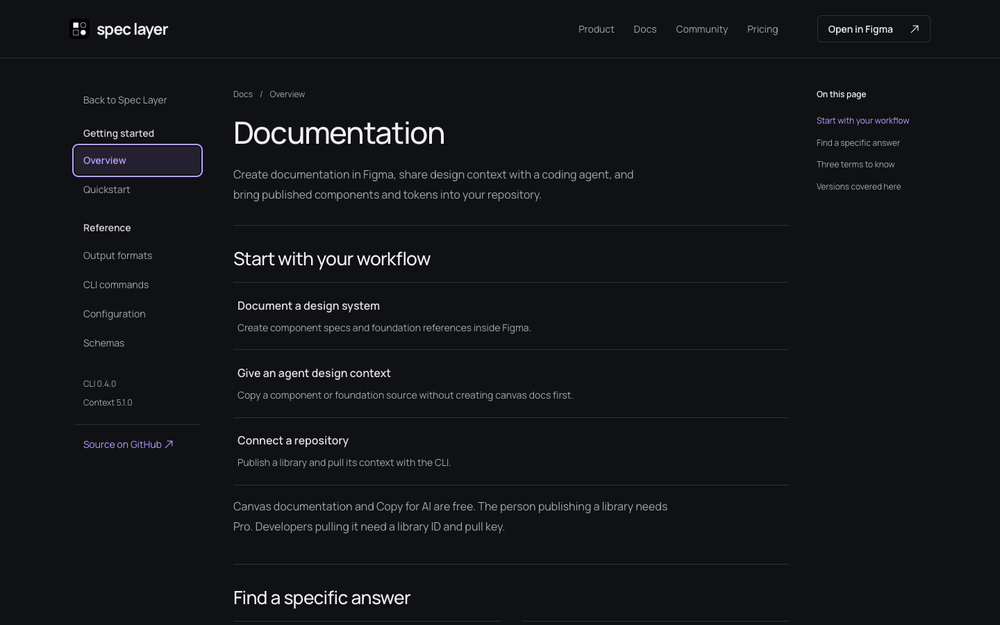
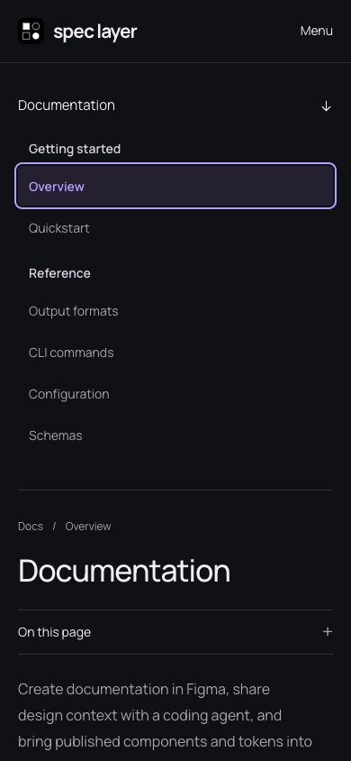

# Website copy, links, and docs menu follow-up

Reviewed 6 September 2026. Changes are in `apps/website` and are now deployed to https://spec-layer.com after the user approved proceeding.

## Changes

- Removed negative sidebar link margins that placed the active row outside its scroll area, clipping the left padding and rounded corners. Section labels and links share a 12px text inset, with consistent row heights and group spacing.
- Kept keyboard focus visible inside the desktop scroll area and allowed it to extend beyond the non-scrolling mobile sidebar.
- Clarified homepage workflow language, DTCG exports, annual savings, and download actions. Linked the refund FAQ directly to support. Simplified the docs introduction, explained canonical JSON, and directed first-time CLI users to setup before pull.
- Extended local link checks to cover absolute URLs on the public domain and dynamically selected gallery images. Added browser regression checks for row bounds, label alignment, section gaps, touch heights, and unclipped focus.

## Verification

- Preview and production website checks passed: 19 generated HTML files, local links and anchors, 12 canonical routes, 29 redirect rules, schemas, examples, metadata, and exact preservation of the five support/policy source bodies.
- Local HTTP verification passed all 50 delivered-response checks.
- Chromium and WebKit passed all 44 browser scenarios, including 12 pages at nine viewport widths (320–1440px), docs navigation, section links, mobile menus, gallery, copy controls, billing selection, downloads, and errors. Axe reported no covered WCAG A/AA violations. See `results.json`.
- The link audit covers 39 unique HTTP destinations and one email link. 36 destinations returned HTTP 200. Both checkout links returned 404 to a cookie-free HTTP client but opened successfully in a browser with the correct monthly/annual selection and price. Email syntax was inspected; no message was sent.
- Desktop and mobile screenshots were visually reviewed. Native screen-reader operation and native browser zoom were not tested.

## External findings

- Figma denied automated access to both the plugin ID URL and its published full slug. The installation destination is unchanged and remains unverified live; this is an access limitation, not proof of a broken link.
- Lemon Squeezy's annual plan description says “Save about $30 compared with monthly billing.” The displayed prices ($7.99/month and $79.99/year) save $15.89. The website states $15.89 correctly. The checkout description must be corrected in Lemon Squeezy; it is not controlled by this website source.

## Production release

The final production deployment is recorded in `release.json`. All 44 Chromium/WebKit scenarios and 50 delivered-response checks passed on spec-layer.com. The homepage, documentation, and shared CSS/JavaScript match the approved output (ignoring Cloudflare exclusion comments); all 12 canonical pages contain the revised terminology. Policy contact addresses retain the existing Cloudflare email protection.

Live verification caught Cloudflare interpreting the versioned npm package name as an email address. Documentation code elements now use Cloudflare's supported email-obfuscation exclusion comments. The delivered-response check rejects email rewriting in documentation pages. No domain-wide email protection setting was changed.

The previous production deployment `84a48c4f-90b1-48f4-867f-a3128929215a` remains the rollback target. Release output and the scoped source patch are retained in `/tmp/spec-layer-improvements-release/`; their hashes are in `release.json`. The private Sites review version 7 predates the final terminology and hosting corrections.
