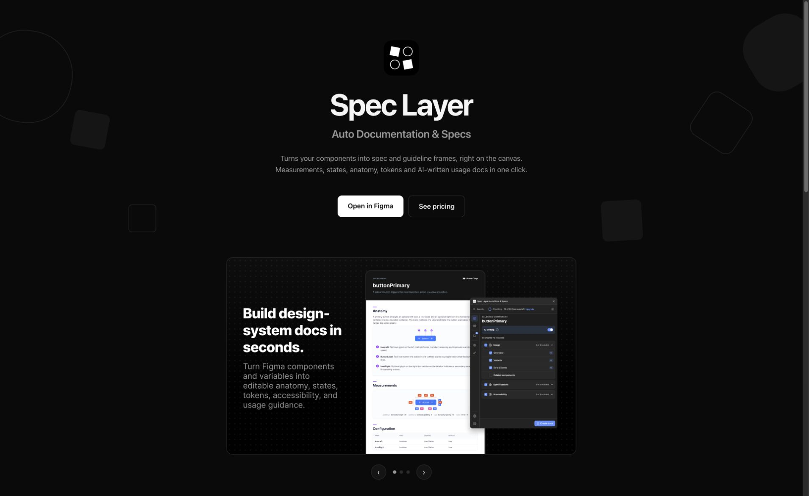
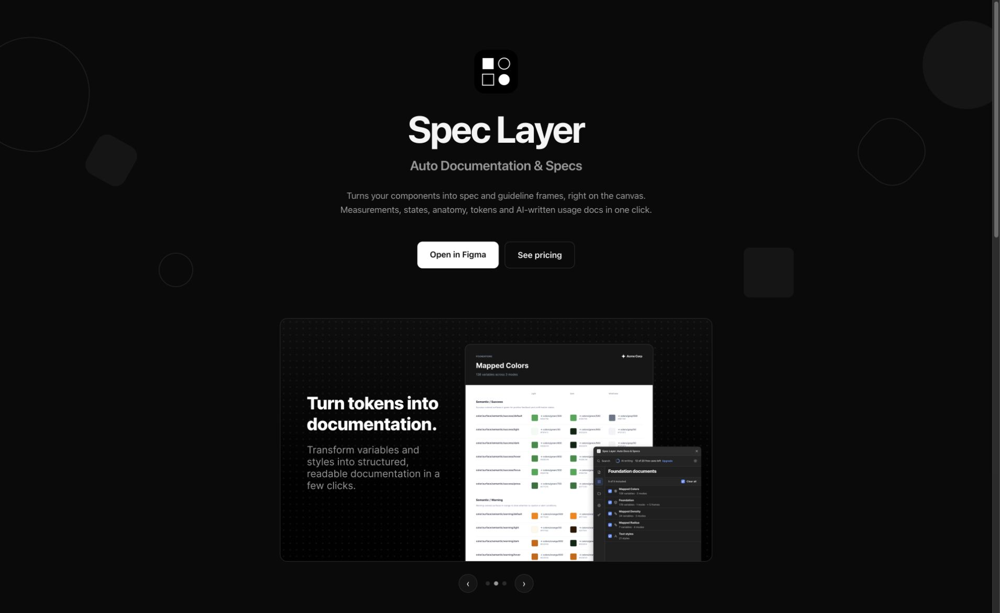
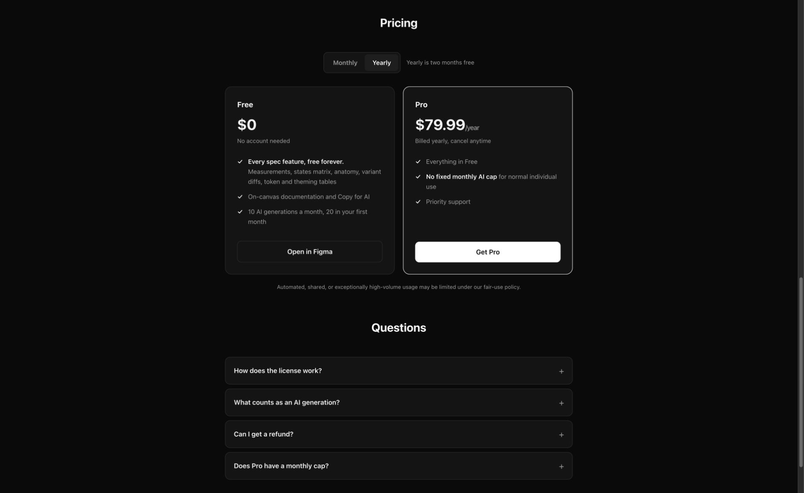
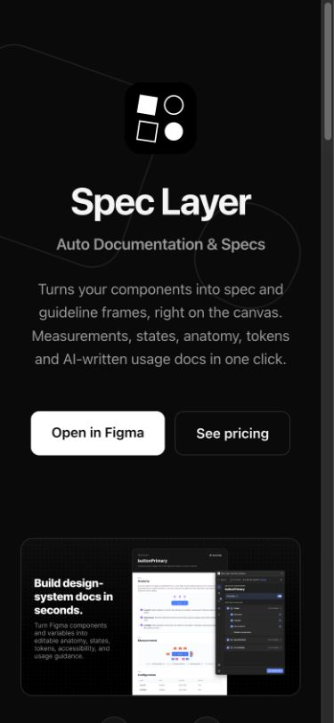
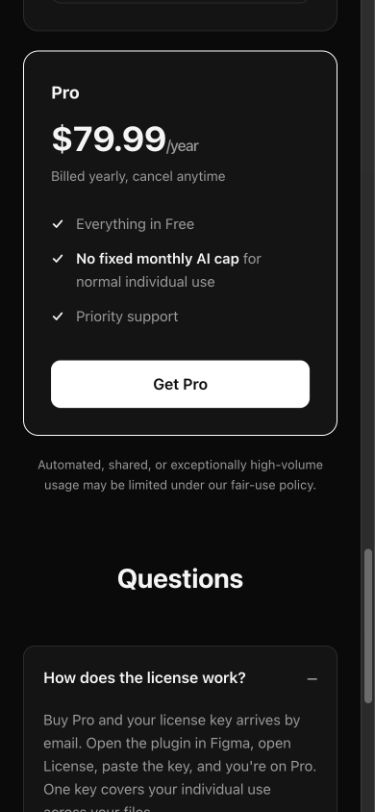
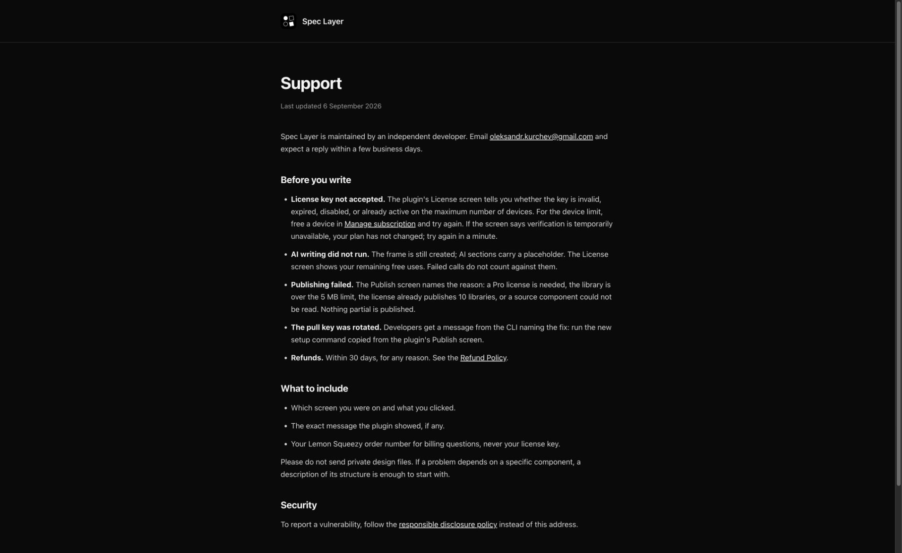
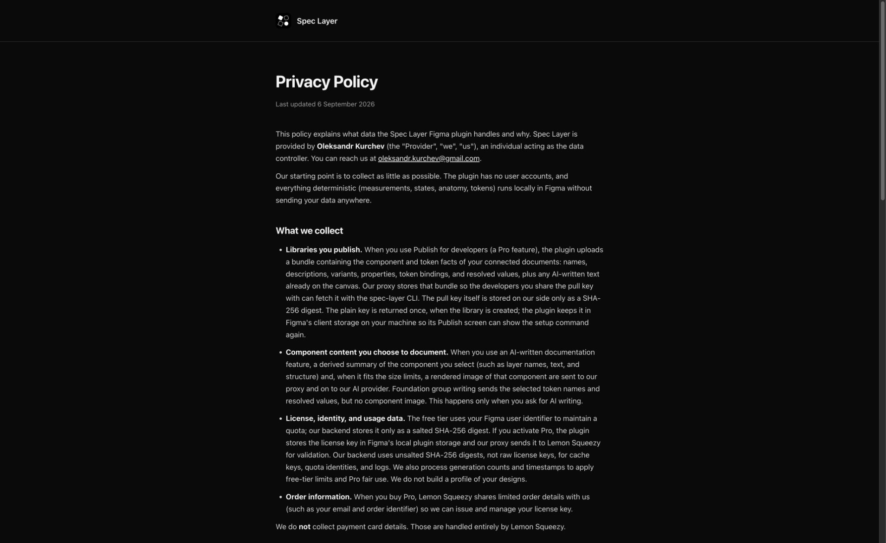

# Spec Layer project and website review

Reviewed 6 September 2026. Repository: `main`, commit `f6f193b`. Website: https://spec-layer.com/.

The website has a coherent visual style, an obvious installation action, and working core interactions. Its largest weakness is that it presents a narrower product than the repository implements: canvas documentation dominates the page, while Copy for AI and the publish/pull workflow receive little or no explanation.

## Highest-priority findings

1. **P1 — Reconcile the deployed website with this checkout before deploying.** The live homepage links to `support.html`, which resolves to a working support page dated 6 September. This checkout has no `apps/landing/support.html` and uses a mail link instead. The live privacy page is also dated 6 September and describes stored library bundles and removal by request; the local policy is dated 28 August and omits publishing, including an unqualified statement that token values are not persisted. A deployment from this folder could regress the live disclosures and remove the support route. Determine the source of the deployed changes and bring them into the intended release source. This is a source/deployment consistency finding, not a legal compliance assessment.

2. **P2 — Explain the full product and the reason to buy Pro.** The hero and six feature descriptions focus on canvas output. Copy for AI appears in the Free card without an example. Publishing for developers is absent from the Pro card, although the README, proxy implementation, and live support/privacy pages identify it as a Pro feature. Add a concise workflow showing Figma → documentation/context → repository, with a real output example. Include library publishing in the plan comparison. Avoid promising unreleased DTCG/CLI capabilities until their release status is confirmed. Sources: `apps/landing/index.html:230`, `:266`, `:346`; `packages/proxy/src/libraries.ts:52`.

3. **P2 — Make the product evidence readable on phones.** At a 390×844 viewport, the layout fits and the main buttons remain legible, but the gallery shrinks a full promotional composition into roughly a 315-pixel-wide image. Embedded plugin text and documentation detail become difficult to inspect. Use focused mobile crops with captions outside the image, or offer an accessible enlarged view. Keep the existing visual identity. Sources: `apps/landing/index.html:245`; screenshots 04 and 08.

4. **P2 — Repair carousel semantics and target sizes.** The live DOM reports 8×8-pixel dot buttons. Their parent has `role="tablist"`, but the buttons have neither tab roles nor an exposed selected/current state; JavaScript changes only the CSS class. Enlarge the clickable areas while retaining small visual dots, and use either a properly implemented tab pattern or ordinary labelled buttons with current-state information. The homepage also lacks a main landmark; group primary content in `<main>`. Sources: `apps/landing/index.html:121`, `:258`, `:594`, `:623`.

5. **P3 — Make the first screen more informative.** The largest heading is the brand name, followed by a generic descriptor. The visuals are consistent, but a newcomer must read the smaller paragraph and gallery to understand the outcome. Keep the brand and use a more specific outcome statement, supported by a legible example. A short “How it works” section and documentation link would help visitors evaluate the developer workflow before installing.

## Observed flow and screenshots

### Step 1 — Desktop introduction and gallery: healthy layout, incomplete story

The white primary CTA stands out, typography and spacing are consistent, and all four image resources loaded. The next-gallery control advanced from slide 1 to slide 2: scroll offset changed from 0 to 830 at a track width of 830. The selected dot changed visually, but not semantically. No warning/error console entries were returned for the inspected homepage session.

### Step 2 — Compare monthly and yearly pricing: working, incomplete Pro benefits

“See pricing” scrolls to the section. Selecting Yearly changes the price from $7.99/month to $79.99/year, changes the billing note, changes the pressed states, and changes the checkout link to the annual variant. No purchase was attempted. Publishing is missing from the Pro benefits.

### Step 3 — Mobile homepage: reflows, product detail too small

At 390×844, no page-wide horizontal overflow was observed; the document scroll width was 375 pixels. The CTA pair remains readable and the plan cards stack vertically. The screenshot details are too small to serve as useful product evidence. The generous hero spacing pushes the gallery controls below the first screen.

### Step 4 — License FAQ: working

Opening “How does the license work?” reveals the expected activation instructions and changes the accessible expanded state. The annual plan and expanded FAQ remained readable in the stacked mobile layout.

### Step 5 — Support: available live, absent locally

The live support page provides concrete troubleshooting, response expectations, and guidance on what to include. Direct navigation to the observed `support.html` destination loaded `/support`. The first automated footer click did not navigate, so it was not counted as a successful link interaction; the destination itself was verified. No email was sent.

### Step 6 — Privacy: current live content differs from source

The support page's privacy link navigated successfully. The live policy explicitly describes published bundles and their retention/removal process. That content is missing from the local HTML. The live privacy footer also uses an email destination for Support, while the homepage uses the support page; standardize that navigation when reconciling the sources.

## Project review

The repository separates responsibilities sensibly: the plugin owns Figma access and rendering, the extractor handles deterministic transformations, the Cloudflare proxy handles AI/licensing/library delivery, and the CLI delivers published artifacts. Keeping the marketing site static is appropriate for its current scope.

Validation completed successfully:

- `npm run lint`
- `npm run typecheck`
- `npm test`: 119 test files passed; 2,207 tests passed; 9 todo.

Vitest emitted a future Vite configuration-loader compatibility warning. No failing check resulted. The CI configuration runs a broader gate than was run in this review. Its visible script chain does not include a landing-page browser or deployed-source parity check; adding a focused smoke check would help cover the website independently of the package tests.

`CLAUDE.md:159` records an outstanding manual Figma validation matrix for the v5 work. This review does not establish whether someone has since completed it elsewhere. Confirm it before treating the passing automated suite as release readiness.

## Limits

This was a repository orientation, automated lint/type/test check, and live website UX/implementation review. It was not an exhaustive code security audit. No source files were modified, no deployment occurred, and only this review and its screenshots were added.

The checkout flow beyond link selection, Figma installation, real plugin operation, licensing, publishing, and CLI network delivery were not executed. Formal assistive-technology testing, a full keyboard pass, reduced-motion emulation, additional mobile breakpoints, performance metrics, and contrast compliance were not established. Reduced-motion handling exists in the source but was not tested in an emulated environment. Screenshot evidence alone does not establish accessibility compliance.

Recommended sequence: reconcile live/source differences; update the homepage and Pro comparison; improve mobile product evidence and carousel accessibility; then run a focused website smoke check alongside the Figma release checks.
