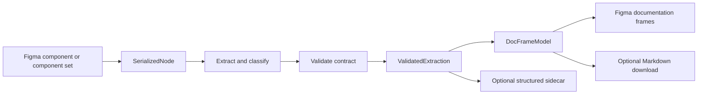

> **Status: superseded, 2026-08-14.** Kept as the record of an argument that
> was largely dissolved rather than implemented.
>
> This document's central move is separating four compatibility versions so
> that Markdown format changes, extraction changes, hash changes, and renderer
> changes stop contaminating each other. Retiring Markdown and the docs web app
> (`77f1412`) removed the contamination at its source: there is now one public
> contract, not two. The part worth keeping shipped as the single
> `EXTRACTOR_VERSION` in `packages/extractor/src/version.ts`.
>
> Two of its problem statements were already stale when written. State
> detection had been unified by Task 6 of the extractor hardening plan, so
> every consumer already calls one `detectStateMatrix`. And the tone-versus-state
> misclassification it identifies is real and still unfixed: `STATE_ORDER` in
> `statesMatrix.ts` contains `error`, `danger`, `warning`, and `success`, so an
> axis like `Tone = Success | Warning | Error` is still read as an interaction
> state matrix, and `detectStateMatrix` still silently takes the first
> state-like axis when several match.
>
> Its runtime JSON Schema validator and provenance records were not adopted.
> See `2026-08-14-copy-for-ai-design.md` for the structured export that
> replaced its sidecar direction.

# Validated component extraction contract

**Date:** 2026-08-13  
**Status:** Proposed  
**Packages:** `packages/extractor`, `packages/plugin`, `packages/format`  
**Primary output:** Connected documentation frames on the Figma canvas  
**Secondary output:** Optional Markdown download and structured export sidecar

## Summary

Spec Layer will formalize the existing `IntermediateSpec` as a versioned and
runtime-validated component extraction contract. The contract sits between the
Figma serializer and every downstream consumer. It is internal product
infrastructure, not a new file users must manage.

The plugin's primary output remains documentation frames on the Figma canvas.
Markdown remains an optional projection of the same `DocFrameModel`. Both are
built from one validated extraction so they cannot interpret component data
differently.

The contract separates four kinds of compatibility that are currently mixed:

1. **Schema version:** the shape and meaning of extracted data.
2. **Extractor version:** the extraction behavior that produced the data.
3. **Hash version:** the canonicalization and projection used for source drift.
4. **Frame renderer version:** the canvas presentation behavior.

It also centralizes semantic property classification, records structured
provenance and diagnostics, and defines failure behavior that never replaces a
good frame with an invalid rebuild.

This is an independent design built around Spec Layer's existing types and
product behavior. It does not reuse the DirectedEdges schema, field definitions,
or documentation text.

## Problem

The current pipeline already has the right broad shape:

```text
Figma node
  -> SerializedNode
  -> IntermediateSpec
  -> DocFrameModel
  -> Figma documentation frames or Markdown
```

However, the boundaries are conventions rather than an enforced contract:

- TypeScript checks `IntermediateSpec` at build time, but plugin runtime data is
  not validated after extraction.
- `SPEC_VERSION` describes the Markdown format in one place and extractor/hash
  compatibility in another.
- State detection is recomputed by multiple consumers. A property can therefore
  be treated as a state in one surface and a variant or modifier in another.
- Extracted values do not consistently explain whether they came from a Figma
  variable, style, hardcoded value, inference, or override.
- Extraction gaps are free-form strings and cannot reliably drive UI, testing,
  or automation.
- A hash mismatch does not identify whether the source changed or the hash
  algorithm changed.
- A renderer-only change cannot be distinguished from an extractor change.
- Invalid data can travel far enough through the pipeline that the eventual
  error appears to be a frame-rendering or download failure.

The result is avoidable ambiguity at exactly the point where the plugin is
expected to produce trustworthy documentation.

## Goals

- Give `IntermediateSpec` a machine-enforced runtime contract.
- Keep Figma documentation frames as the primary product output.
- Build frames and Markdown from the same validated presentation model.
- Separate schema, extraction, hash, renderer, and product-build versions.
- Use one semantic classification result in every consumer.
- Preserve raw Figma names and values while adding semantic meaning alongside
  them.
- Record where important extracted claims came from.
- Represent incomplete or ambiguous extraction as structured diagnostics.
- Make creation, update, drift checking, and download fail safely and
  predictably.
- Preserve current generated documents and accept legacy sidecars.
- Create a stable boundary for future renderers or code-oriented tooling without
  expanding today's product scope.

## Non-goals

- Replacing `IntermediateSpec` with the DirectedEdges component schema.
- Modelling a complete implementation-level element and style tree.
- Adding a user-facing JSON editor or requiring users to manage JSON files.
- Changing the visual design or section structure of generated frames.
- Changing the current Markdown body or download interaction.
- Making Markdown the canonical internal representation.
- Generating production component code.
- Persisting the full extraction envelope on every Figma Section.
- Inferring behavior, accessibility, or intent that Figma does not express.
- Adding semantic-classification settings to the plugin UI in the first release.
- Reworking the Foundation extraction contract in this initiative. Foundations
  may adopt the same versioning pattern later under a separate specification.

## Product principles

### One extraction, two projections

The validated extraction is the source for a single `DocFrameModel`. The Figma
frame builder and Markdown serializer are projections of that same model.



No renderer may reclassify props, reparse variant names, or infer a second view
of the component independently.

### Preserve evidence, label inference

Raw source identity and values are preserved. Semantic roles are annotations,
not replacements. Inferred values carry the rule and confidence that produced
them. Ambiguous inferences become diagnostics instead of being presented as
facts.

### Validate before side effects

Validation completes before AI generation, canvas mutation, download, or
connected-document metadata writes. An invalid update leaves the existing frame
and its metadata untouched.

### Compatibility is explicit

A version field has one responsibility. Changing extraction behavior must not
masquerade as a Markdown schema migration or source-design drift.

## Terminology

| Term | Meaning |
|---|---|
| `SerializedNode` | Plain Figma-derived input produced at the plugin API boundary. |
| `IntermediateSpec` | Existing deterministic component payload extracted from `SerializedNode`. |
| `ExtractionMetadata` | Source identity, timestamps, and compatibility versions. |
| `SemanticModel` | Shared property roles and resolved state representation. |
| `ProvenanceRecord` | Evidence describing the source of an extracted or inferred claim. |
| `ExtractionDiagnostic` | Structured error, warning, or informational limitation. |
| `ValidatedExtraction` | Metadata, payload, semantics, provenance, and diagnostics after validation. |
| `DocFrameModel` | Presentation model consumed by both canvas and Markdown renderers. |

## Contract ownership

`packages/extractor` owns the contract, validator, semantic rules, provenance,
diagnostics, and content hashing. It remains pure and must not reference Figma
globals.

`packages/plugin/src/serialize.ts` remains the only component Figma API adapter.
It supplies enough source evidence for the extractor to distinguish bindings,
styles, literals, and omissions.

`packages/plugin/src/ui/docModel.ts` consumes only validated extraction results.
It remains the single owner of presentation selection and section composition.

`packages/plugin` persists only compact compatibility and drift metadata on the
generated Section. It does not persist the complete extraction unless an export
workflow explicitly writes a sidecar.

`packages/format` continues to own the public Markdown frontmatter contract. Its
`spec_version` must describe only that Markdown contract.

### Expected implementation boundaries

The implementation plan may adjust exact filenames, but ownership should follow
this shape:

| File or area | Expected responsibility |
|---|---|
| `packages/extractor/schema/` | Versioned JSON Schema and contract fixtures. |
| `packages/extractor/src/contract.ts` | Envelope types, version constants, and result type. |
| `packages/extractor/src/validate.ts` | Structural and cross-field validation. |
| `packages/extractor/src/semantics.ts` | Classification, overrides, and shared state model. |
| `packages/extractor/src/provenance.ts` | Provenance types and path helpers. |
| `packages/extractor/src/extract.ts` | One validated extraction entry point. |
| `packages/extractor/src/hash.ts` | Versioned deterministic hash behavior. |
| `packages/plugin/src/ui/docModel.ts` | Presentation projection from validated extraction. |
| `packages/plugin/src/docLink.ts` | Compact v2 connected-document metadata and legacy parsing. |
| `packages/plugin/src/messages.ts` | Contract metadata passed with frame-render requests. |
| `packages/plugin/src/ui/actions.ts` | Create, update, download, and drift failure handling. |
| `packages/format` and `spec/SPEC.md` | Markdown format version only. |

No validation or classification logic should be duplicated in plugin UI files.

## Data model

### Version identifiers

```ts
/** Shape and semantic meaning of ValidatedExtraction. */
export type ExtractionSchemaVersion = '1.0';

/** Behavior revision of deterministic component extraction. */
export type ExtractorVersion = string;

/** Canonicalization and source-hash projection revision. */
export type ContentHashVersion = '1';

/** Canvas presentation revision. */
export type FrameRendererVersion = string;
```

Versions are opaque identifiers for equality checks. They are not ordered with
string comparison. A compatibility table owned by the current build determines
which schema versions can be read or migrated.

### Extraction metadata

```ts
export interface ExtractionMetadata {
  schemaVersion: ExtractionSchemaVersion;
  extractorVersion: ExtractorVersion;
  hashVersion: ContentHashVersion;
  extractedAt: string; // ISO 8601
  source: {
    kind: 'figma';
    fileKey: string;
    nodeId: string;
    componentKey: string;
    componentName: string;
  };
}
```

`extractedAt` is operational metadata and is never included in a deterministic
content hash.

### Semantic property classification

```ts
export type PropertyRole =
  | 'state'
  | 'variant'
  | 'modifier'
  | 'size'
  | 'appearance'
  | 'behavior'
  | 'content'
  | 'accessibility'
  | 'unknown';

export type ClassificationSource =
  | 'override'
  | 'property-name'
  | 'property-values'
  | 'property-kind'
  | 'fallback';

export interface PropertyClassification {
  property: string; // exact cleaned property name used by IntermediateSpec
  role: PropertyRole;
  source: ClassificationSource;
  confidence: 'high' | 'medium' | 'low';
  rule: string; // stable rule id, not prose used as program logic
}

export interface SemanticStateModel {
  encoding: 'enum' | 'flags';
  axis: string | null;
  stateProperties: string[];
  rowAxis: string | null;
  columns: {
    label: string;
    override: Record<string, string>;
  }[];
}

export interface SemanticModel {
  properties: PropertyClassification[];
  state: SemanticStateModel | null;
}
```

The semantic model is computed once. `## States`, `## Variants`, modifiers,
variant grids, token pivots, AI prompt summaries, frame rendering, and Markdown
serialization all consume this exact result.

### Classification overrides

```ts
export interface ClassificationOverrides {
  properties?: Record<string, {
    role: PropertyRole;
  }>;
  state?: {
    encoding: 'enum';
    axis: string;
  } | {
    encoding: 'flags';
    properties: string[];
  } | null;
}
```

An explicit override wins over every inferred rule. The first release exposes
this as an extractor API only. A future UI may persist per-component overrides,
but that storage and interaction are out of scope here.

### Provenance

```ts
export type ProvenanceOrigin =
  | 'figma-property'
  | 'figma-variable'
  | 'figma-style'
  | 'figma-literal'
  | 'derived'
  | 'inferred'
  | 'override';

export interface ProvenanceRecord {
  /** RFC 6901 JSON Pointer rooted at `/spec` or `/semantics`. */
  path: string;
  origin: ProvenanceOrigin;
  nodeIds: string[];
  sourceProperty?: string;
  sourceName?: string;
  rule?: string;
}
```

Provenance uses paths instead of embedding metadata into every data object. This
keeps `IntermediateSpec`, token resolution, and renderer inputs compact while
still allowing a claim to be traced.

The initial implementation must emit provenance for:

- property definitions and defaults;
- variant-instance axis values;
- token and style bindings;
- hardcoded values;
- semantic classifications;
- synthesized state columns;
- extraction diagnostics that name a source node.

Provenance may be omitted from normal frame metadata and included in structured
exports. It is not user-visible in the initial release.

### Diagnostics

```ts
export type DiagnosticSeverity = 'error' | 'warning' | 'info';

export interface ExtractionDiagnostic {
  code: string;
  severity: DiagnosticSeverity;
  message: string;
  path?: string;
  nodeIds?: string[];
  recoverable: boolean;
}
```

Diagnostic codes are stable API. Messages are display copy and may change.

Required initial codes:

| Code | Severity | Meaning |
|---|---|---|
| `schema.invalid` | error | The extraction does not satisfy the runtime schema. |
| `source.identity-missing` | error | Required component or file identity is absent. |
| `variant.unknown-axis` | error | An instance or token condition references an undeclared axis. |
| `variant.unknown-value` | error | An instance or token condition references an undeclared value. |
| `variant.duplicate-combination` | warning | Physical variants resolve to the same canonical combination. |
| `state.ambiguous` | warning | State inference was plausible but not reliable enough to apply. |
| `binding.unresolved` | warning | A variable or style reference could not be resolved. |
| `value.hardcoded` | info | A documented value is not bound to a variable or style. |
| `content.unsupported` | warning | Source content exists but the contract cannot represent it. |

Existing `Gap { part, issue }` values remain readable during migration. The new
extractor emits structured diagnostics, and renderers may derive legacy gap copy
from diagnostics until `Gap` is retired under a later schema version.

### Validated extraction

```ts
export interface ValidatedExtraction {
  metadata: ExtractionMetadata;
  spec: IntermediateSpec;
  semantics: SemanticModel;
  provenance: ProvenanceRecord[];
  diagnostics: ExtractionDiagnostic[];
}

export type ExtractionResult =
  | { ok: true; value: ValidatedExtraction }
  | { ok: false; diagnostics: ExtractionDiagnostic[] };
```

`ok: true` may include warnings and informational diagnostics. Any error
diagnostic produces `ok: false` and no `ValidatedExtraction`.

## Runtime schema

The repository will contain a canonical JSON Schema for
`ValidatedExtraction`. It must:

- identify itself with a stable `$id` containing the schema version;
- use JSON Schema Draft 2020-12;
- reject missing required fields and invalid enum values;
- permit additive unknown fields only at explicitly extensible boundaries;
- set `additionalProperties: false` on stable data objects;
- validate Figma identity strings as non-empty;
- validate timestamps as `date-time`;
- validate diagnostic paths as JSON Pointer strings;
- validate that arrays contain objects of the expected shape;
- avoid network resolution at runtime.

The validator must be bundled or compiled for the plugin. It must not fetch a
schema or dependency while the plugin runs.

TypeScript types and the JSON Schema are two views of the same contract. CI must
detect drift between them using fixtures and compile-time assertions. A schema
change is incomplete until both views and their tests change together.

JSON Schema validates structure. Cross-field rules remain explicit TypeScript
semantic validation because JSON Schema is a poor fit for axis/value reference
integrity and provenance-path existence.

## Semantic validation

After structural validation, the extractor must enforce these invariants:

1. `metadata.source` agrees with `spec.figmaFile`, `spec.figmaNode`,
   `spec.figmaKey`, and `spec.name`.
2. Property names are unique after cleaning.
3. Every property default is valid for its kind and belongs to its option set
   when an option set exists.
4. Variant axis names are unique and match variant properties.
5. Variant axis values are non-empty and unique within an axis.
6. Every variant-instance key names a declared axis or the shared `Variant`
   pseudo-axis fallback.
7. Every variant-instance value belongs to its declared axis.
8. Variant node ids are unique.
9. Every token condition names a declared axis and only declared values.
10. Token rules do not contain the internal absence sentinel.
11. Anatomy ids are unique within the extraction.
12. `anatomyComponentId` identifies the component used as the anatomy coordinate
    space.
13. Semantic classifications name known properties.
14. The state model references known properties, axes, and values.
15. Every provenance path resolves into `spec` or `semantics`.
16. Error diagnostics cannot be present in a successful result.

Canonical ordering is preserved from source where order is meaningful.
Collections used only for equality or hashing must be sorted deterministically.

## Semantic classification rules

Classification follows this precedence:

1. Explicit override.
2. Exact property-name convention.
3. Strong interaction-state evidence in values.
4. Property kind and value shape.
5. Conservative fallback.

### State classification

The state classifier must distinguish interaction states from semantic status or
appearance values.

High-confidence state evidence includes:

- an axis named `State` or `States`;
- an explicit state override;
- boolean axes named for interaction states such as `Hover`, `Focused`,
  `Pressed`, `Selected`, or `Disabled`.

Medium-confidence evidence includes an axis named `Status` whose values contain
at least two interaction lifecycle values such as `Default`, `Hover`, `Focus`,
`Pressed`, or `Disabled`.

Values such as `Success`, `Warning`, `Danger`, and `Error` are not sufficient by
themselves. An axis such as `Tone = Success | Warning | Error` remains an
appearance or variant axis unless explicitly overridden. This avoids turning a
semantic color choice into an interaction-state matrix.

When multiple axes are plausible state axes and no override resolves the
conflict, the classifier emits `state.ambiguous`, returns no state model, and
leaves the axes visible as variants. It must not silently choose the first.

### Classification stability

Each inferred classification records a stable rule id, for example
`state.name.exact`, `state.values.lifecycle`, or `modifier.boolean`. Tests assert
rule ids and output roles, not the wording of explanations.

## Versioning and compatibility

### Markdown `spec_version`

`packages/format` retains `spec_version` exclusively for the public Markdown
frontmatter and body contract. An extraction or hash change does not bump this
value. A Markdown version bump requires an updated `spec/SPEC.md`, parser
compatibility decision, examples, and migration notes.

### Extractor version

`extractorVersion` changes when deterministic extraction semantics can change
for an unchanged `SerializedNode`. Refactors that are proven output-identical do
not require a bump.

An extractor-version mismatch means the connected frame should be rebuilt. It
does not mean the Figma component changed.

### Hash version

`hashVersion` changes when canonicalization, included fields, or the hash
algorithm changes. Hashes with different hash versions must never be compared.

The first delivery preserves the current `specContentHash` projection and labels
it hash version `1`. Improving the projection is a later intentional hash-version
change, not an incidental extractor change.

### Frame renderer version

`frameRendererVersion` changes when the same validated extraction and config can
produce a materially different canvas document. Pure internal refactors do not
require a bump.

A renderer-version mismatch means rebuild required even when extraction and
source content are unchanged.

### Plugin version

The existing `pluginVersion` remains build provenance for support and debugging.
It is not used as a compatibility version because most plugin releases do not
require rebuilding documentation.

## Connected-document persistence

The complete `ValidatedExtraction` is not stored on a generated Section. A
compact version 2 component link is sufficient:

```ts
export interface ComponentDocLinkV2 {
  v: 2;
  kind: 'component';
  sourceNodeId: string;
  contentHash: string;
  selfHash: string;
  config: DocConfig;
  generatedAt: number;
  pluginVersion: string;
  contract: {
    schemaVersion: ExtractionSchemaVersion;
    extractorVersion: ExtractorVersion;
    hashVersion: ContentHashVersion;
    frameRendererVersion: FrameRendererVersion;
  };
}
```

`parseDocLink` continues to accept version 1 links. A v1 component link is
treated as rebuild required because one or more compatibility versions are
unknown. Rebuilding writes v2 atomically. No file-wide migration scan is
required.

The `specVersion` field introduced for extractor hardening is read as a legacy
compatibility hint only. It must not remain the long-term version authority.

## Compatibility and document status

Compatibility, source state, and manual-edit state are independent facts:

```ts
interface ComponentDocumentStatus {
  compatibility: 'current' | 'rebuild-required' | 'invalid';
  source: 'in-sync' | 'update-available' | 'missing' | 'unknown';
  document: 'unchanged' | 'edited';
}
```

Resolution order:

1. If the source node is missing, `source = missing`.
2. If stored metadata cannot be parsed, `compatibility = invalid`.
3. If the stored schema is unknown or stale, `compatibility = rebuild-required`.
   Connected frames do not contain an extraction payload that needs migration;
   they can be rebuilt from their linked source.
4. If extractor, hash, or renderer versions are unknown or stale,
   `compatibility = rebuild-required`.
5. Only when hash versions match may stored and current content hashes be
   compared.
6. `selfHash` is evaluated independently and may report `edited` alongside any
   source or compatibility status.

The Library should not collapse simultaneous facts into a misleading single
claim. For example, an edited frame whose source also changed should be allowed
to read `Edited · Update available`.

## Operation behavior

### Create frame

1. Serialize the selected Figma source.
2. Extract payload, semantics, provenance, and diagnostics.
3. Run structural and semantic validation.
4. Stop on any error before requesting AI prose.
5. Generate optional prose on a best-effort basis.
6. Build one `DocFrameModel` from the validated extraction and selected config.
7. Send the model and compact compatibility metadata to the main thread.
8. Build the Section off-canvas.
9. Write the v2 link only after the Section build succeeds.
10. Insert the new Section and update the registry.

### Update frame

1. Resolve and serialize the linked source.
2. Complete extraction and validation without mutating the existing Section.
3. Build the replacement Section off-canvas.
4. Preserve the existing Section if extraction, validation, AI fallback,
   rendering, or metadata serialization fails.
5. Replace the Section and write v2 metadata as one logical commit.

Manual-edit warnings continue to apply. Validation does not grant permission to
overwrite an edited document.

### Download Markdown

1. Extract and validate exactly as frame creation does.
2. Build the same `DocFrameModel` with the same selection and config.
3. Serialize that model with `modelToMarkdown`.
4. Do not mutate the canvas or connected-document metadata.

The Markdown reflects the current source and stored config, not manual edits to
the canvas frame. That existing behavior remains explicit.

### Drift check

Drift extraction validates before hashing. When validation fails, the Library
reports that the source could not be checked. It must not label the document
drifted or in sync.

When `hashVersion` differs, the Library reports rebuild required and does not
compare values. When it matches, source drift remains a deterministic
`specContentHash` comparison.

### Structured sidecar

The current sidecar continues to serialize `IntermediateSpec` during the first
delivery, but it is validated before export. This avoids breaking existing
consumers.

A later sidecar contract version may serialize the complete
`ValidatedExtraction`. When introduced, the sidecar must include its schema
version and retain a documented legacy-reader path. That change requires an
update to `spec/SIDECAR.md` and is not implicit in this work.

## Failure behavior and UI copy

Errors are actionable and non-destructive.

| Situation | Behavior | User-facing copy |
|---|---|---|
| Invalid new extraction | Frame creation stops | `This component could not be read reliably. Nothing was created.` |
| Invalid download extraction | Download stops | `This component could not be read reliably. Nothing was downloaded.` |
| Invalid update extraction | Existing frame remains | `This component could not be read reliably. The existing frame was not changed.` |
| Drift validation fails | Status remains unknown | `Could not check this component.` |
| Rebuild required | Do not call it source drift | `Rebuild required` |
| Unsupported schema | Do not attempt partial rendering | `This document was created with an unsupported data format.` |
| Warning-only diagnostics | Continue and preserve warnings | Existing gap presentation or a future details surface |

Detailed diagnostic codes may be included in development logs and tests. Logs
must not include component text, AI prompts, image bytes, license keys, or other
customer content beyond the minimum source node ids needed for local debugging.

## Hashing rules

- Hash input is deterministic and contains no timestamps, diagnostic messages,
  provenance records, build versions, or plugin configuration.
- Hash version `1` retains the existing projection to avoid a mass drift event.
- A future field is included in hash version `1` only if adding it cannot change
  the value for existing extractions. Otherwise the hash version must change.
- Hash comparison is invalid across different hash versions.
- `selfHash` remains a hash of rendered text used only for manual-edit detection.
- AI prose remains excluded from source drift and included in `selfHash` after it
  is rendered.

## Performance and storage constraints

- Structural plus semantic validation should complete within 20 ms at the 95th
  percentile for a component with 100 variants on a typical desktop device.
- Validation must not traverse the live Figma tree. It operates on plain data.
- Validation adds no network request.
- Schema and validator code should add no more than 40 kB compressed to the
  plugin bundle unless a measured exception is accepted.
- Provenance is held in memory only during normal create/update operations.
- Persisted v2 compatibility metadata should add less than 250 bytes to a
  component link under ordinary version-string lengths.
- Sidecar size is allowed to grow when provenance is eventually exported, but
  structured export must remain deterministic and UTF-8 encoded.

## Privacy and security

- All deterministic extraction, classification, validation, provenance, and
  hashing remain local to the plugin.
- Validation never causes component data to leave the Figma file.
- AI receives only the same validated derived summary and optional bounded image
  already permitted by the existing AI boundary.
- A validation error prevents the AI request. Warning-only ambiguity continues
  with the conservative validated representation and may use the normal AI path.
- JSON Schema references are bundled and cannot resolve remote content.
- Diagnostic messages are escaped before insertion into UI or Markdown.

## Schema evolution

Changes are classified before implementation:

| Change | Version action |
|---|---|
| Add an optional diagnostic code | No schema bump |
| Add an optional field at an extensible boundary | Schema patch documentation only |
| Add a required field | New schema version |
| Change field meaning or enum semantics | New schema version |
| Change extraction output for unchanged input | Extractor version bump |
| Change hash projection or canonicalization | Hash version bump |
| Change frame output for unchanged model | Frame renderer version bump |
| Change Markdown frontmatter/body contract | Markdown `spec_version` bump |

Every schema version must have:

- a checked-in JSON Schema;
- matching TypeScript types;
- valid and invalid fixtures;
- a compatibility decision for the previous readable version;
- migration notes or an explicit rebuild-only decision;
- updated structured-export documentation if the sidecar changes.

## Testing strategy

### Contract fixtures

Maintain a fixture corpus covering:

- plain component;
- rectangular component set;
- sparse variant grid;
- raw-name `Variant` fallback;
- enum state axis;
- boolean state flags;
- semantic status or tone axis that must not become interaction state;
- duplicate canonical variant combination;
- hardcoded values;
- unresolved binding;
- hidden subtree;
- empty anatomy;
- invalid axis and value references;
- legacy sidecar and v1 document link.

Every valid fixture must pass JSON Schema and semantic validation. Every invalid
fixture must fail with the expected stable code.

### Cross-consumer invariants

Tests must prove:

1. States consumed by `DocFrameModel` equal the validated semantic state model.
2. Variant sections exclude exactly the properties consumed by the state model.
3. Token pivots use the same state properties.
4. Markdown and frame builders receive the same `DocFrameModel`.
5. The same validated extraction and config produce deterministic model output.
6. A hash-version mismatch never performs a hash comparison.
7. Invalid updates leave the prior Section and metadata unchanged.
8. A v1 document link reads successfully and resolves to rebuild required.
9. A successful rebuild writes a v2 link.
10. Provenance paths resolve to existing values.

The existing 400-trial token round-trip property test remains a required gate.
Add a classification property test asserting that a property is never consumed
simultaneously as both state and non-state variant output.

### Verification gates

- Unit tests for structural and semantic validation.
- Type checking for schema/type alignment.
- Plugin frame integration tests.
- Markdown snapshot tests from the shared model.
- Drift and connected-document migration tests.
- Bundle-size comparison.
- Manual plugin checks for create, update, edited update, rebuild-required,
  invalid source, and Markdown download.

## Acceptance criteria

The initiative is complete when:

- Every component create, update, download, and drift path uses the validated
  extraction entry point.
- No production consumer receives an unvalidated `IntermediateSpec` directly.
- Runtime structural and semantic validation are covered by fixtures.
- State classification is computed once and used by frames, Markdown, token
  pivots, variant displays, and AI summaries.
- Interaction states and semantic tone/status values are distinguishable and
  overrideable.
- Connected component documents store schema, extractor, hash, and renderer
  versions independently.
- Markdown `spec_version` no longer changes for extractor-only or hash-only
  compatibility events.
- Hashes are never compared across hash versions.
- Legacy connected documents remain discoverable and rebuild in place.
- Invalid updates do not modify or remove an existing frame.
- Frame and Markdown output continue to derive from the same `DocFrameModel`.
- Existing Markdown output is byte-stable unless a separately approved format
  change is included.
- Existing sidecars remain readable.
- Full CI, plugin builds, bundle budget, and manual acceptance checks pass.

## Delivery phases

### Phase 1: Contract and version separation

- Add the envelope types and schema.
- Add structural and semantic validators.
- Introduce extractor and hash versions.
- Keep current hash version `1` behavior.
- Route all extraction entry points through validation.
- Correct `SPEC_VERSION` ownership so it describes Markdown only.

### Phase 2: Shared semantics and diagnostics

- Replace independent state checks with `SemanticModel` consumption.
- Add classification rules, rule ids, and API overrides.
- Emit structured diagnostics while deriving legacy gaps.
- Fix duplicate-combination handling so conflicting physical variants are
  preserved or explicitly diagnosed, never silently discarded.

### Phase 3: Provenance and connected-document v2

- Emit required provenance records.
- Add v2 component link metadata.
- Resolve compatibility, source state, and manual edits independently.
- Rebuild v1 links in place without a migration scan.

### Phase 4: Export readiness

- Validate existing sidecars before export.
- Document whether a later sidecar version should export the full envelope.
- Add complete structured-export fixtures and compatibility tests before making
  that format change.

Each phase must be independently releasable and keep existing connected frames
usable.

## Decisions and rationale

| Question | Decision | Reason |
|---|---|---|
| What is the canonical internal input to renderers? | `ValidatedExtraction`, projected through `DocFrameModel` | Makes runtime validity and shared semantics enforceable. |
| What remains the primary output? | Figma documentation frames | Matches the current product and user workflow. |
| What is Markdown? | Optional serialization of the shared presentation model | Keeps frame and download content aligned without making Markdown internal state. |
| Is the full extraction persisted on frames? | No | Compact metadata is enough for drift and rebuild; source is re-extracted. |
| Does JSON Schema handle all validation? | No | It handles structure; TypeScript handles cross-field integrity. |
| Are semantic roles allowed to rename Figma props? | No | Roles annotate evidence and preserve source truth. |
| Are ambiguous states guessed? | No | Ambiguity produces a warning and conservative variant output. |
| Does an extractor change bump Markdown format? | No | These are separate contracts. |
| Does a hash change look like design drift? | No | Hashes are compared only when hash versions match. |
| Are DirectedEdges schema assets reused? | No | The design is independently expressed using Spec Layer's existing model. |

## Attribution boundary

This specification adopts general software architecture practices: runtime
schema validation, explicit compatibility versions, provenance, diagnostics,
and semantic annotations. It does not copy or adapt the DirectedEdges schema.
No DirectedEdges attribution is required for implementing this document as
written.

If a future change copies or closely adapts DirectedEdges schema fields, type
definitions, descriptions, examples, or distinctive structure, that change must
be reviewed separately and include the attribution required by its license.
