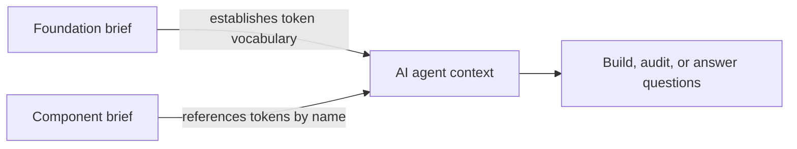

# Copy for AI: YAML component and foundation briefs

**Date:** 2026-08-14
**Status:** Proposed
**Packages:** `packages/extractor`, `packages/plugin`
**Replaces:** the retired Markdown download (`77f1412`)

## Summary

Spec Layer gains a **Copy** action that puts a YAML brief on the clipboard for
an AI coding agent. Two briefs, copied separately:

1. A **foundation brief** — every variable with its resolved value per mode,
   plus text styles. Copied once to establish the token vocabulary.
2. A **component brief** — one component's API, anatomy, states, token
   bindings, and stored guidelines, referencing tokens by the names the
   foundation brief already introduced.

YAML is the only export format. Markdown and the docs web app were removed in
`77f1412`, so the brief is now the single public contract the product exposes,
and `EXTRACTOR_VERSION` is its only compatibility version.

## Problem

The plugin's primary output is documentation frames on the Figma canvas, read by
humans. Its export path was Markdown, aimed at the same audience. That path is
gone, and nothing replaced it.

Meanwhile the actual demand is different: people want to hand a component to an
AI coding agent and have it build or check an implementation. Competing plugins
answer this with a Copy button that yields a structured payload. Spec Layer
already extracts far more than those payloads carry — variant-conditioned token
rules, anatomy depth, WCAG AA findings, layout summaries — but has no way to
hand any of it to a model.

Three jobs the brief must serve, all of which assume the user already has a
codebase and a design system in code:

- **Build it in my codebase.** The agent maps Figma tokens onto tokens the
  project already has.
- **Audit an existing implementation.** The agent checks `Button.tsx` against
  the spec.
- **General design-system context.** The agent knows the system while doing
  unrelated work.

None of these is "build from scratch", so the brief references tokens by name
rather than inlining resolved values as the primary representation.

## Goals

- One Copy action per documented component, in the Library, where Download was.
- One Copy action for the file's foundation.
- A single YAML schema covering both, versioned independently of the extractor.
- Token bindings pre-resolved per variant so the consuming model never
  evaluates a condition.
- Guidelines included from what was already generated, never regenerated.
- Copy is instant, free, and quota-free.
- Honest reporting of what is not tokenized and what fails contrast.
- No new runtime dependency in the plugin bundle.

## Non-goals

- Reinstating Markdown in any form.
- A library-wide bundle covering every component in one payload. The schema
  leaves room for it; this release does not build it.
- Generating production component code inside the plugin.
- A user-configurable token naming convention or prefix mapping.
- Changing what the canvas frames render.
- Changing the AI prose prompt or its output shape.

## The two-payload model

The foundation brief is copied first and establishes the vocabulary. Component
briefs then reference tokens by bare name, which keeps them small and keeps one
mapping decision (Figma token to code token) in one place instead of repeated
per component.



### The token-to-code bridge

`FoundationVariable.codeSyntax` carries Figma's per-platform code syntax and is
already captured (`serializeFoundation.ts:129`, `main.ts:105`,
`foundation.ts:280`). It is emitted when present and the key is omitted
entirely when absent.

It is **not** the bridge, because it is a field a designer must type per
variable in Figma and is empty in most files. The bridge is **name plus
resolved value**, which always exists: the foundation brief gives every
variable its name and its concrete value per mode, so an agent can map
`color/bg/brand = #2563EB` onto whatever the codebase calls it, by name
similarity or by matching the value against an existing tokens file.

## Schema

### Envelope

Both briefs open with the same envelope.

```yaml
spec_layer:
  kind: component | foundation
  version: 1                      # brief schema version
  extractor: "1"                  # EXTRACTOR_VERSION that produced the data
  generated: 2026-08-14T10:22:00Z
```

`version` changes when the brief's shape or field meanings change. It is
independent of `EXTRACTOR_VERSION`: an extraction fix that leaves the brief
shape untouched bumps the extractor only, and a brief reshaping that reads the
same extraction bumps the brief only.

### Foundation brief

```yaml
spec_layer: { kind: foundation, version: 1, extractor: "1", generated: ... }
source: { file: abc123 }

collections:
  - name: Color
    modes: [Light, Dark]
    default_mode: Light
    tokens:
      - name: color/bg/brand
        type: color
        description: Primary brand surface
        code: { web: "--color-bg-brand" }        # omitted when codeSyntax is empty
        values: { Light: "#2563EB", Dark: "#3B82F6" }
      - name: color/bg/muted
        type: color
        values:
          Light: { alias: color/neutral/100, resolved: "#F5F5F5" }
          Dark:  { unresolved: external }

text_styles:
  - name: Body/Regular
    font: { family: Inter, style: Regular, size: 16 }
    line_height: { unit: PIXELS, value: 24 }
    letter_spacing: { unit: PERCENT, value: 0 }
```

Modes are keyed by name, not `modeId`, since ids are internal. An alias emits
both its target name and its resolved value so the agent can prefer the
semantic reference while still knowing the concrete value. An unresolved value
states its reason (`cycle`, `missing`, `external`, `depth`) from
`FoundationValue` rather than being dropped.

### Component brief

```yaml
spec_layer: { kind: component, version: 1, extractor: "1", generated: ... }
source: { file: abc123, node: "1:100", component_key: m3-button }

component:
  name: Button
  related: [Icon]

api:                              # spec.props
  - { name: label,    kind: text,           default: "Button" }
  - { name: size,     kind: variant,        options: [Small, Medium, Large], default: Medium }
  - { name: icon,     kind: instance-swap,  default: "Icon/Arrow" }
  - { name: disabled, kind: boolean,        default: false }

axes:                             # spec.variants
  - { prop: Style, values: [Filled, Outlined] }
  - { prop: State, values: [Enabled, Hovered, Disabled] }

states: [Enabled, Hovered, Disabled]

anatomy:                          # spec.anatomy, nested via `depth`
  - part: container
    type: FRAME
    children:
      - { part: icon,  type: INSTANCE, component: Icon }
      - { part: label, type: TEXT }

layout:                           # spec.layout
  - { part: container, summary: "horizontal, gap 8" }

tokens:
  base:
    - { part: container, property: border-radius, token: radius/md, value: 8 }
    - { part: label,     property: typography,    token: type/label-large }
  by_variant:
    - when: { Style: Filled, State: Enabled }
      bindings:
        - { part: container, property: fill, token: color/bg/brand, value: "#2563EB" }
    - when: { Style: Filled, State: Hovered }
      bindings:
        - { part: container, property: fill, token: color/bg/brand-hover }

unbound:                          # spec.gaps
  - { part: container, issue: "hardcoded itemSpacing (8px)" }

contrast:                         # spec.contrast
  measured: 4
  skipped: 1
  findings:
    - { pair: "label on container", variant: "Style=Outlined, State=Disabled",
        ratio: 3.1, required: 4.5, result: fail }

guidelines:                       # stored ProseDrafts, never regenerated
  definition: |
    ...
  accessibility: |
    ...
  interactions: |
    ...
  dos:   ["...", "..."]
  donts: ["...", "..."]
```

#### Why `base` plus `by_variant`

`TokenRule` stores minimized conditions (`part`, `property`, `conditions`,
`token`). Emitted directly, that asks the consuming model to evaluate a boolean
expression to answer "what is the background of Filled/Hovered?".
`resolveTokensForVariant` already performs that evaluation, so the brief emits
resolved bindings per variant instead.

Emitting every binding for every variant is correct but wasteful: a 60-variant
component with 15 bindings each is roughly 900 near-identical lines. So
bindings common to **every** variant are factored into `base`, and `by_variant`
carries only what differs. This is both smaller and clearer, matching how a
person describes a component and how the resulting code is written.

#### Resolved values

`value` is resolved through the foundation at the component's default mode,
using the same name lookup `contrast.ts:174` already performs. It is omitted
when no foundation is loaded or the variable is external. The drift path calls
`extract()` without a foundation, so the brief must state absence plainly
rather than implying the token has no value, matching the honesty rule
`contrast` already follows.

#### `unbound` and `contrast`

Both are included. `unbound` tells the agent which values have no variable, so
it does not invent token names for them, which is the failure mode when a brief
silently omits untokenized values. `contrast` makes the audit job checkable and
reports `measured` and `skipped` counts so a run that measured nothing cannot
read as a pass.

## Prose persistence

Component prose is not persisted today. `ComponentDocLink` has no prose field
and `ai.ts`'s cache is an in-memory `Map` that dies with the plugin session.
The only durable copy of already-generated guidelines is text inside the
rendered frame.

**Decision:** persist `ProseDrafts` at frame-creation time, mirroring the
precedent `FoundationDocLink.groupDescriptions` already sets for foundation
docs.

**Under a separate pluginData key, not on the doc link.** The library scan
parses every documented Section's doc link on every refresh
(`main.ts:680` and the surrounding loop). Prose inside that blob would make
each refresh parse kilobytes of AI text per document to draw a row that never
displays it. Prose therefore lives under `DOC_PROSE_KEY`, read only when Copy
runs.

Constraints:

- Figma caps plugin data at 100 kB per node. `ProseDrafts` is a few kB in
  practice. The writer truncates and records a diagnostic rather than throwing
  if a document somehow exceeds a 64 kB budget.
- Prose is written in the same commit as the doc link, after the Section build
  succeeds, so a failed build never leaves prose describing a document that
  does not exist.
- Prose reflects what was generated, not later hand-edits to the frame. This
  matches the retired Download's documented behavior, which reflected the
  source rather than canvas edits.
- A document generated before this change has no stored prose. Its brief omits
  `guidelines` entirely rather than emitting empty strings, and Copy says so.

## YAML emitter

A small deterministic emitter in `packages/extractor/src/yaml.ts`, written for
the brief shapes specifically rather than as a general YAML library.

**No runtime dependency.** Both ends are controlled, the shapes are closed, and
determinism matters because the output is snapshot-tested. js-yaml would add
roughly 40 kB to a bundle whose `ui.html` is already about 630 kB, to serialize
shapes that are already known.

**The risk is escaping**, not structure: strings containing colons, `#`,
newlines, leading or trailing spaces, quotes, or characters that would parse as
numbers or booleans.

**The mitigation is a dev-only dependency.** js-yaml is added under
`devDependencies` and the tests parse the emitter's output with it, asserting
the round-trip equals the input object. This gives real YAML conformance
checking with zero shipped bytes, and a property test over generated strings
covers the escaping cases.

## Surfaces

### Library row

A `copy` action in the row overflow menu, where `download` was before `77f1412`
removed it. Gated on the same condition the old action used: a component row
whose source still exists.

`copyBriefFromSource` in `actions.ts` mirrors the shape the removed
`downloadFromSource` had: resolve the source, re-extract, build the brief, but
with three differences.

- It does **not** call `generateProse`. Guidelines come from `DOC_PROSE_KEY`.
- It does **not** mutate the canvas or any document metadata.
- It ends by writing to the clipboard rather than creating a Blob.

### Foundations footer

A Copy action alongside the existing foundation actions in
`foundationFooterMarkup`, emitting the foundation brief for the current
selection scope.

### Clipboard

**This is the highest-risk part of the feature and is task one of the plan.**

`navigator.clipboard.writeText` is frequently blocked by permissions policy
inside a Figma plugin iframe. The usual fallback, a hidden textarea plus
`document.execCommand('copy')`, only works inside the user-gesture call stack.
Extraction is asynchronous, so by the time the payload exists the gesture is
gone and both paths can fail.

`packages/plugin/src/ui/clipboard.ts` implements three tiers:

1. `navigator.clipboard.writeText`.
2. A hidden textarea plus `document.execCommand('copy')`.
3. A modal containing the YAML in a pre-selected textarea.

Tier 3 always works and is the correctness floor. Which tier actually fires in
Figma determines whether Copy is one click or two, and it must be measured in a
real Figma session before any payload work begins. If only tier 3 is reachable,
the design changes to precompute the brief when the row menu opens so the click
itself is synchronous.

## Failure behavior

Copy never mutates anything, so every failure is recoverable by retrying.

| Situation | Behavior | Copy |
|---|---|---|
| Source node missing | No copy | `That component is not in this file anymore.` |
| Extraction throws | No copy | `Could not read that component. Nothing was copied.` |
| No foundation loaded | Copy proceeds | `Copied. Token values are missing because foundations have not been read yet.` |
| No stored guidelines | Copy proceeds, `guidelines` omitted | `Copied. This document was made before guidelines were saved, so it has none.` |
| Clipboard tiers 1 and 2 fail | Tier 3 modal | `Select the text below and press Cmd C.` |
| Large payload | Copy proceeds | `Copied. 1,240 lines, which is large for some chat windows.` |

The brief is never silently truncated. A payload over the threshold is copied
whole and the count is reported, because a quietly shortened brief reads as
complete and is worse than a long one.

All copy above follows `docs/plugin-voice-and-copy.md`: plain peer tone, no em
dashes.

## Testing

**Extractor, pure and fixture-based:**

- Foundation brief fixtures: multi-mode collection, alias chain, external
  unresolved alias, empty `codeSyntax`, populated `codeSyntax`, text styles.
- Component brief fixtures: plain component, rectangular variant set, sparse
  grid, boolean state flags, `Variant` raw-name fallback, no foundation loaded,
  no stored prose.
- `base` and `by_variant` factoring: a binding present on every variant lands
  in `base`; a binding that differs on one variant does not.
- Every emitted `by_variant.when` names a declared axis and a declared value.
- YAML round-trip through js-yaml (dev dependency) for every fixture.
- Property test over adversarial strings: colons, `#`, newlines, quotes,
  leading and trailing spaces, numeric-looking and boolean-looking strings.
- Determinism: the same spec and foundation produce byte-identical YAML.

**Plugin:**

- Prose written under `DOC_PROSE_KEY` at creation, and read back by Copy.
- A failed Section build writes neither the doc link nor prose.
- The library scan does not read `DOC_PROSE_KEY`.
- Copy mutates no canvas node and no document metadata.
- Copy never calls `generateProse` and never touches quota.
- Clipboard tier fallback: tiers 1 and 2 stubbed to fail, tier 3 renders.
- Existing documents with no stored prose omit `guidelines`.

**Manual, in real Figma:** the clipboard tier spike, then Copy on a component
with a foundation loaded, without one, with stored prose, and without.

## Phases

Each phase is independently releasable.

**Phase 1: Clipboard spike.** Build `clipboard.ts` with all three tiers and a
throwaway button. Measure which tier fires in real Figma. Everything downstream
depends on the answer, and no payload work starts before it.

**Phase 2: Prose persistence.** Add `DOC_PROSE_KEY`, write `ProseDrafts` at
frame creation alongside the doc link, read it on demand. Ships without any
Copy surface and is verifiable on its own.

**Phase 3: The briefs.** `yaml.ts` and `brief.ts` in the extractor, with the
full fixture corpus and round-trip tests. Pure, no plugin changes.

**Phase 4: The surfaces.** The Library row action and the foundations footer
action, wired to phases 1 through 3.

## Decisions

| Question | Decision | Reason |
|---|---|---|
| One format or two? | YAML only | Markdown is retired; two shapes for two briefs would fragment the contract. |
| JSON or YAML? | YAML | Roughly 25 to 30 percent fewer tokens for the same data, which matters when pasting a 400-variable foundation. |
| Ship a YAML library? | No | Closed, known shapes and snapshot-tested output do not justify 40 kB; js-yaml as a dev dependency gives conformance checking for free. |
| One payload or two? | Two | Foundations establish the vocabulary once; component briefs stay small and reference it. |
| Is `codeSyntax` the bridge? | No | It is empty in most files. Emitted opportunistically; name plus resolved value is the real bridge. |
| Are token conditions pre-resolved? | Yes | Evaluating minimized conditions is a class of error the brief can simply remove. |
| Does Copy regenerate prose? | No | It would cost quota and time to write text for another model to read. |
| Where does prose live? | A separate pluginData key | The library scan parses every doc link on every refresh; prose there would tax a hot path. |
| Are `unbound` and `contrast` included? | Yes | Silence about untokenized values makes agents invent token names. |
| Is a large brief truncated? | No | A quietly shortened brief reads as complete. Report the size instead. |
| Library-wide bundle? | Deferred | Same schema at a different scope; no reason to build it before per-component Copy proves out. |

## Open questions

- Whether the foundations Copy should respect the current scope selection or
  always emit the whole file. Scope selection is the existing behavior for
  foundation docs, so the plan assumes it, but the AI use case may favor the
  whole file. Resolve during Phase 4.
