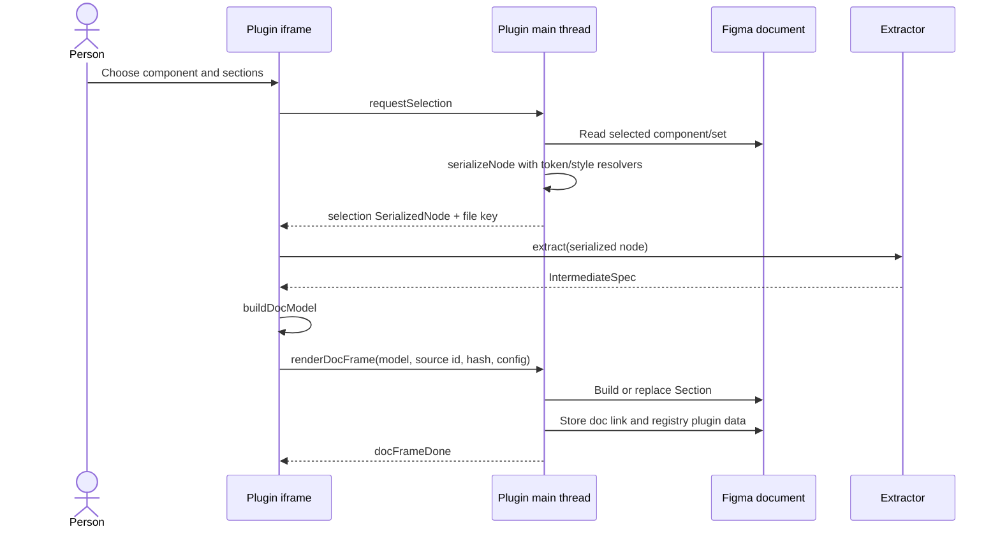
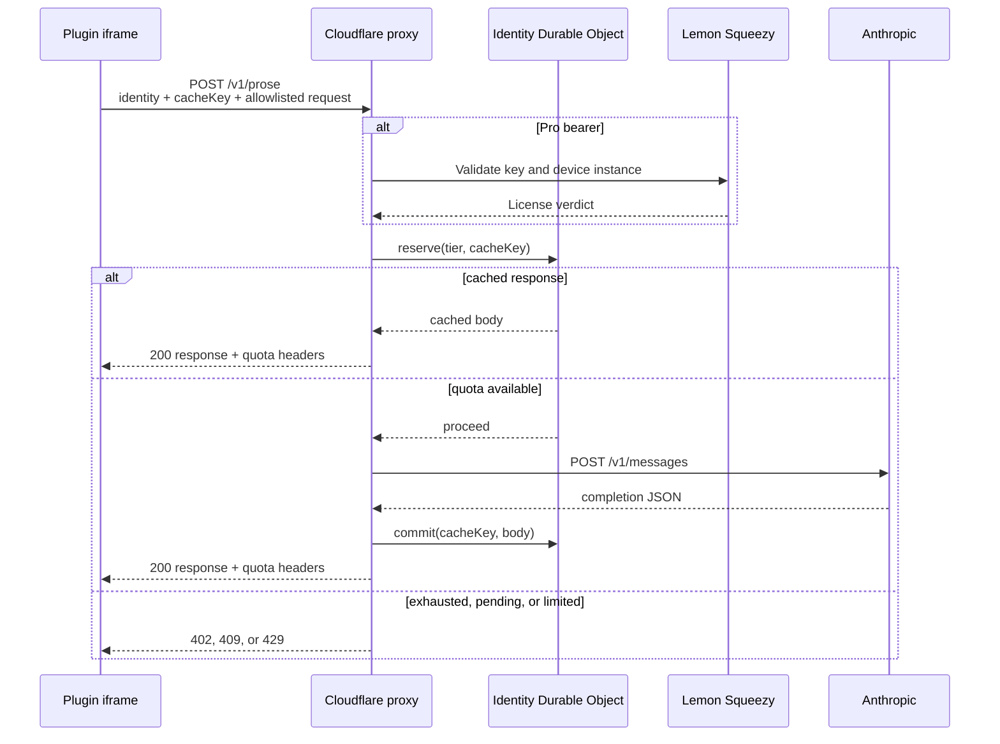
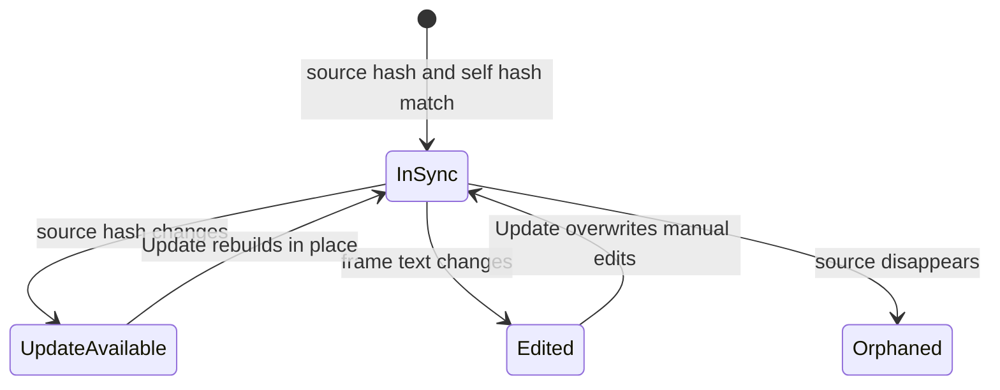
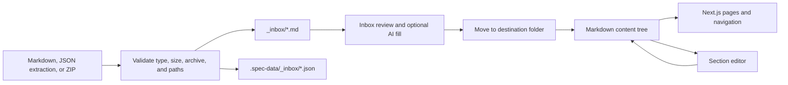

# Data flows

> [!warning] Archived snapshot
> This page predates the August 2026 removal of the web app, format package,
> Markdown/ZIP output, and Send to docs. See [[ARCHIVE-NOTICE]].

## Component extraction and canvas generation



The extractor derives anatomy, properties, variants, states, tokens, gaps, layout, raw values, related components, and variant instances. The UI converts that intermediate model into a selected set of canvas sections. The main thread then materializes Figma nodes.

## Optional AI prose



The prompt contains derived component fields and, when requested, a base64 PNG rendered from the selected node. The full raw Figma tree is not sent. See [[Proxy API]] and [[Security and Privacy]].

## Markdown download

1. The UI extracts or reuses the current `IntermediateSpec`.
2. Optional AI prose is generated for checked prose sections.
3. `buildDocModel` assembles the chosen documentation model.
4. `modelToMarkdown` renders the selected model.
5. The browser iframe creates a local Blob and triggers a `.spec.md` download.

No documentation server participates in this path.

## Bulk ZIP export

`buildExportFiles` writes two parallel trees:

```text
<folder>/<component-slug>.md
.spec-data/<folder>/<component-slug>.json
```

The JSON sidecar stores the complete `IntermediateSpec`, including structured data not present in Markdown, such as per-variant instances. `fflate` creates the ZIP. Slug collisions receive `-2`, `-3`, and later suffixes.

## My Library drift and update

Each generated Figma Section stores:

- source kind and source address;
- source content hash at generation time;
- plugin version;
- generation configuration;
- self hash of rendered text;
- optional foundation descriptions.

The Figma document root stores a registry of generated section IDs. On refresh, the plugin compares the stored source hash with a fresh extraction and compares the stored self hash with current frame text.



Foundation docs resolve by collection/group scope rather than a component node ID. Their source is the file's variable and text-style data.

## Legacy web import and authoring



The web app can call Anthropic directly from its server with a locally configured key. This is separate from the plugin proxy quota system.

## Foundation extraction and generation

1. Main thread reads local variable collections, variables, modes, aliases, external references, and local text styles.
2. `serializeFoundation` emits a plain `SerializedFoundation`.
3. `buildFoundation` resolves values and aliases into a `FoundationSpec`.
4. `planFoundationUnits` splits large collections and limits rendered mode columns.
5. Optional AI produces folder/group descriptions.
6. Main thread builds or replaces branded foundation Sections.

See [[Extractor Package]] and [[Figma Plugin]].
