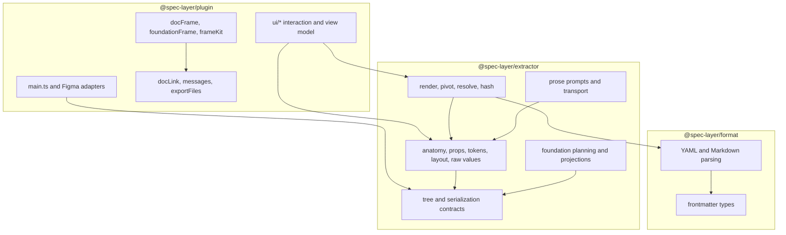

# Module map

> [!warning] Archived snapshot
> This map includes packages and output paths deleted in August 2026. See
> [[ARCHIVE-NOTICE]] and `docs/plugin-knowledge-map.md` for the current map.

## Workspace packages

| Workspace | Documentation | Main responsibility |
|---|---|---|
| `@spec-layer/format` | [[Format Package]] | Versioned Markdown/frontmatter types, serialization, parsing |
| `@spec-layer/extractor` | [[Extractor Package]] | Pure component/foundation extraction, hashing, rendering, and AI prompt client |
| `@spec-layer/plugin` | [[Figma Plugin]] | Figma main thread, iframe UI, frame rendering, downloads, source links |
| `@spec-layer/proxy` | [[Proxy Worker]] | Anthropic relay, licensing, quotas, rate limits, idempotency |
| `md-ds` | [[Legacy Web App]] | Local Markdown app and API |

## Non-workspace areas

| Path | Documentation | Responsibility |
|---|---|---|
| `apps/landing` | [[Landing Site]] | Static public website and policy pages |
| `spec` | [[Markdown Specification]] | Normative Spec Layer file format |
| `docs` | [[Source Catalog]] | Backlog, product, prose, and plugin knowledge notes |
| `.github` | [[Development and Testing]] | CI, templates, ownership, dependency updates |

## Internal layering

For a file-by-file inventory, see [[Source Catalog]].
