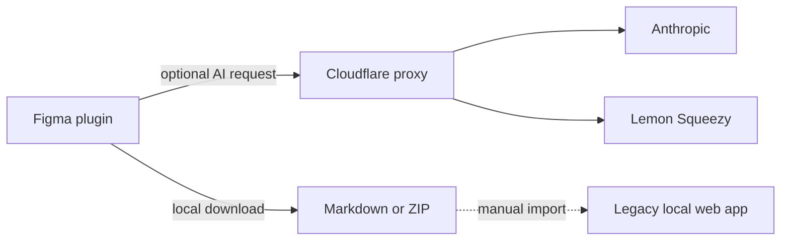

# Product overview

Spec Layer is a local-first Figma-to-documentation toolkit. Its primary product is a Figma plugin that reads a component or component set, deterministically derives structural information, optionally asks an AI model for judgment-oriented prose, and produces documentation directly on the Figma canvas or as Markdown.

## Primary capabilities

- Extract component anatomy, properties, variants, states, token bindings, raw values, layout, and gaps.
- Generate branded component guideline frames inside Figma.
- Generate foundation documentation for local variable collections and text styles.
- Add optional AI-written overview, accessibility, interaction, design, content, and do/don't guidance.
- Track generated frames in **My Library**, detect source drift and manual edits, and update a frame in place.
- Download one component as Markdown or export multiple components as a ZIP with structured `.spec-data` sidecars.
- Apply a configurable visual theme and captured logo to generated frames.
- Enforce free and Pro AI usage through a Cloudflare Worker.

## Product surfaces

### Figma plugin

The plugin is the main user-facing application. It has two Figma runtimes:

1. A main thread with privileged Figma API access.
2. An iframe UI that owns interaction state, deterministic model assembly, downloads, and proxy requests.

See [[Figma Plugin]].

### Cloudflare proxy

The proxy protects the Anthropic API key, validates Lemon Squeezy licenses, applies quotas, rate limits requests, and caches a successful response for idempotent retries. See [[Proxy Worker]] and [[Proxy API]].

### Legacy local docs app

The Next.js app reads and writes a local directory of Markdown documents. It supports imports, an inbox workflow, section editing, local AI enrichment, navigation, search, settings, and Figma previews.

It is explicitly described as legacy and is not recommended for new use. The current plugin does not post directly to it. ZIP and Markdown exports can still be imported manually. See [[Legacy Web App]].

### Landing site

The marketing site is static HTML with policy pages and Lemon Squeezy checkout links. See [[Landing Site]].

## Deterministic versus judgment content

| Content | Source | Network required |
|---|---|---|
| Anatomy | Serialized Figma node tree | No |
| Configuration | Figma component property definitions | No |
| Variants and states | Component set axes and variant names | No |
| Tokens and raw values | Variable/style bindings and node values | No |
| Layout and measurements | Serialized geometry and layout data | No |
| Foundations | Local variables, modes, aliases, and text styles | No |
| Definition and usage prose | Anthropic through the proxy | Yes, optional |
| Accessibility and interactions | Anthropic through the proxy | Yes, optional |
| Design/content considerations | Anthropic through the proxy | Yes, optional |

The deterministic layer remains usable without an account, license, or network connection.

## Current versus historical behavior

> [!warning]
> Some root and web-app documentation still refers to a token-authenticated **Send to docs** flow. Current plugin source contains no docs endpoint and explicitly describes downloads as local Blob operations. Treat plugin-to-web delivery as historical unless it is deliberately reintroduced.

The currently supported integration between the primary plugin and external infrastructure is:

## Related notes

- [[System Architecture]]
- [[Data Flows]]
- [[Markdown Specification]]
- [[Network and External Services]]
