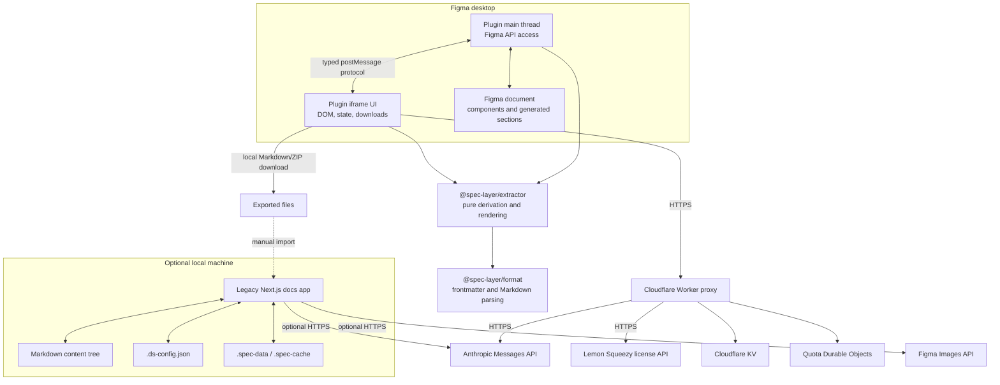
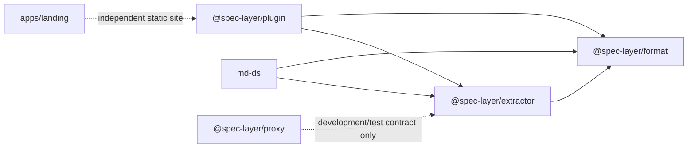

# System architecture

Spec Layer is an npm-workspaces monorepo with several runtime areas connected by data contracts rather than a shared server application.

## Runtime topology

## Package dependency direction

The intended dependency rule is:

- `format` owns the portable Markdown envelope.
- `extractor` owns pure, Figma-independent derivation.
- `plugin` owns Figma API access and the primary product UI.
- `proxy` owns server authority for AI access, quota, and licensing.
- `apps/web` owns legacy local persistence and authoring.
- `apps/landing` owns public marketing and policy content.

## Architectural boundaries

### Figma API boundary

Only plugin main-thread code should call privileged Figma APIs. It converts Figma nodes and foundation APIs into plain serializable objects before the extractor sees them.

The iframe communicates with the main thread through the union types in `packages/plugin/src/messages.ts`. See [[Plugin Message Protocol]].

### Pure extraction boundary

`@spec-layer/extractor` accepts `SerializedNode` and `SerializedFoundation` values. It must not import or depend on the Figma runtime. This makes extraction deterministic and fixture-testable.

### Markdown contract boundary

`@spec-layer/format` validates the versioned frontmatter and parses Markdown sections. The normative format lives in `spec/SPEC.md`. See [[Markdown Specification]].

### Network authority boundary

The plugin cannot call arbitrary domains because its Figma manifest allowlists only the Spec Layer staging proxy. The proxy, not the plugin, holds `ANTHROPIC_API_KEY` and decides quota and license status.

### Local filesystem boundary

The legacy web app runs as a loopback-only local tool. Its Markdown content tree is the source of truth. It is not a public, authenticated, or multi-tenant service.

## Core invariants

1. Deterministic component content is reproducible from a serialized source tree.
2. Content hashes exclude non-deterministic prose so rewriting prose does not create source-drift noise.
3. Foundation hashes cover the rendered projection, not extraction metadata or unrendered fields.
4. Generated Figma docs persist a link to their source and a self hash for manual-edit detection.
5. Only successful, uncached AI generations consume quota.
6. Raw license keys and raw Figma user IDs must not become Durable Object names or log fields.
7. The local web app must constrain filesystem paths to the configured content root.

## See also

- [[Data Flows]]
- [[Module Map]]
- [[Data and Storage]]
- [[Security and Privacy]]
