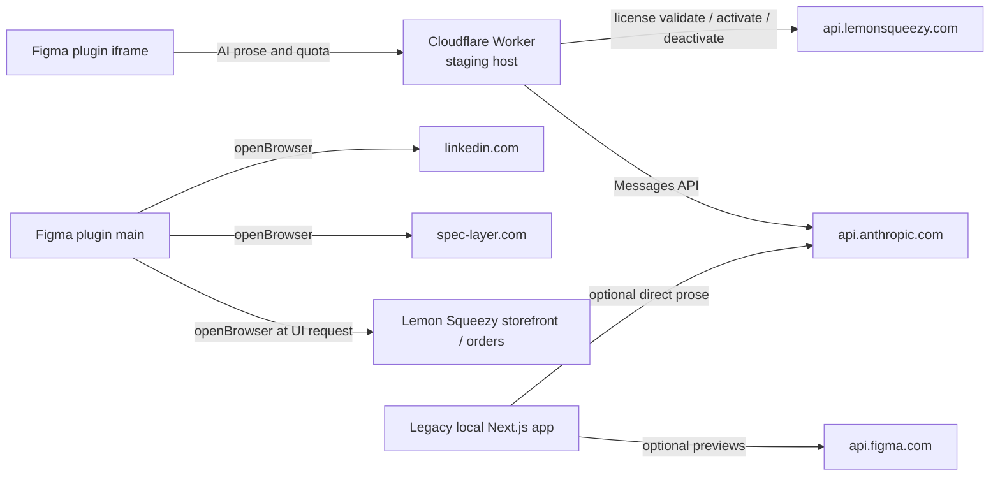

# Network and external services

## Complete network map

## Figma plugin destinations

### Active request destination

`https://spec-layer-proxy.spec-layer-test.workers.dev`

Used for:

- `POST /v1/prose`
- `GET /v1/quota`
- `POST /v1/license/activate`
- `POST /v1/license/deactivate`

This is the only domain in `manifest.json` `networkAccess.allowedDomains` and `devAllowedDomains`.

### Links opened in the system browser

Defined in `packages/plugin/src/ui/proxy.ts`:

- `https://speclayer-docs.lemonsqueezy.com/checkout`
- `https://app.lemonsqueezy.com/my-orders`
- `https://speclayer-docs.lemonsqueezy.com`
- `https://spec-layer.com/`
- a LinkedIn author page

These are navigation links, not fetch destinations for component data.

## Proxy outbound calls

### Anthropic

`POST https://api.anthropic.com/v1/messages`

Headers:

- `content-type: application/json`
- `x-api-key: <ANTHROPIC_API_KEY>`
- `anthropic-version: 2023-06-01`

The Worker forwards the allowlisted request body and returns the Anthropic JSON response.

### Lemon Squeezy

Base:

`https://api.lemonsqueezy.com/v1/licenses`

Paths:

- `/validate`
- `/activate`
- `/deactivate`

Requests use public license endpoint semantics and JSON bodies containing the key and optional instance ID/name.

### Cloudflare internal services

- KV binding for license verdict cache.
- Durable Object namespace for quota and idempotency state.

## Legacy web app outbound calls

### Figma Images API

`GET https://api.figma.com/v1/images/<file-key>?ids=<node-ids>&format=png&scale=2`

Authentication: `X-Figma-Token`.

The Next.js fetch caches previews for one hour.

### Anthropic

The Next.js server can call `https://api.anthropic.com/v1/messages` directly through the extractor prose client. The configured key never needs to enter browser JavaScript.

## Local web API

The legacy browser UI calls relative `/api/*` routes on the loopback Next.js server. See [[Legacy Web API]].

## Data classification by path

| Path | Potential data |
|---|---|
| Plugin → proxy | Derived component summary, selected generated image, cache key, free identity or license bearer |
| Proxy → Anthropic | Prompt derived from component data and optional image |
| Proxy → Lemon Squeezy | License key and device instance data |
| Legacy app → Figma | Figma file key, node IDs, personal access token |
| Legacy app → Anthropic | Derived spec prompt, optional Figma-rendered image |

## Important operational notes

- The plugin points to staging in both code and manifest.
- Proxy CORS permits `*` because the Figma iframe origin is opaque and authentication is header-based.
- The local app's `Origin: null` allowance is historical compatibility and should not be treated as user authentication.
- There is currently no plugin request to `localhost` and no live **Send to docs** path.

## Related notes

- [[Proxy API]]
- [[Legacy Web API]]
- [[Security and Privacy]]

