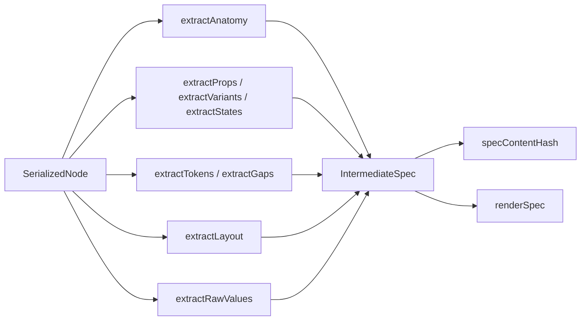

# Extractor package

`@spec-layer/extractor` is the pure transformation core. It consumes plain JSON-like structures and produces component specifications, foundation projections, hashes, Markdown, and AI prompt contracts.

## Inputs

### `SerializedNode`

A Figma-independent tree carrying the fields needed for extraction:

- identity and type;
- dimensions and children;
- component property definitions;
- variant names and keys;
- variable/style token bindings;
- raw paint, typography, and layout data;
- nested component references.

The plugin owns conversion from real Figma nodes into this shape.

### `SerializedFoundation`

A raw dump of:

- local variable collections and modes;
- variables and `valuesByMode`;
- local and external aliases;
- local text styles and bindings.

## Component output

`extract(root, { figmaFile })` returns `IntermediateSpec`:

| Field | Meaning |
|---|---|
| `name` | Component or component-set name |
| `figmaKey`, `figmaFile`, `figmaNode` | Stable source identity |
| `anatomy` | Ordered parts and nesting |
| `anatomyComponentId` | Default component coordinate space |
| `props` | Variant and non-variant properties |
| `variants` | Axes and values |
| `variantInstances` | Physical variant node IDs and axis combinations |
| `states` | State vocabulary or `Default` fallback |
| `tokens` | Condition-aware token rules |
| `related` | Nested component names |
| `gaps` | Extraction limitations discovered in the source |
| `layout` | Human-readable layout summaries |
| `rawValues` | Hardcoded values not represented by bindings |

## Deterministic pipeline

## Token extraction

`tokens.ts`:

- parses variant instance names into axis/value conditions;
- creates the shared axis model;
- normalizes part names;
- extracts condition-aware token rules;
- detects gaps where a deterministic representation is incomplete.

`pivot.ts` turns token rules into Markdown tables:

- color rules pivot by part, state, and a dominant variant axis;
- boolean axes become modifier subtables;
- unconditioned color bindings are merged into a fixed table;
- typography and measurements use flat tables;
- exceptions preserve rules outside the chosen pivot.

`resolve.ts` resolves the rule set for one concrete variant combination.

## State matrix

`statesMatrix.ts` identifies state-like axes and computes a bounded matrix shape for canvas documentation. It recognizes more than a literal `State` label through its state vocabulary rules.

## Foundation model

`foundation.ts`:

- resolves local aliases synchronously;
- represents inaccessible remote values as named external references;
- groups variables by top-level name segment and folder;
- splits collections over `SPLIT_THRESHOLD` (`150`) rows;
- limits rendered modes to `MAX_MODE_COLUMNS` (`4`);
- plans one or more `FoundationUnit` documents;
- produces `FoundationUnitContent`, the exact rendered projection;
- derives stable unit titles and row group headings.

`unitContent` is the key boundary: rendering and `foundationContentHash` use the same projection. Metadata that is not drawn does not create drift.

## Hashing

`contentHash` hashes a recursively canonicalized value with SHA-256.

`specContentHash` intentionally excludes AI prose and presentation-only fields so a source drift alert represents a deterministic source change.

`foundationContentHash` hashes the rendered foundation unit. AI folder descriptions remain outside the source-drift hash but remain covered by the plugin's self-edit hash.

## Markdown rendering

`renderSpec` emits the strict Spec Layer v0.1 section order, frontmatter, deterministic tables, optional prose, related links, and optional extraction gaps.

The active plugin's selected-section download uses its own `DocFrameModel` renderer (`modelToMarkdown`) because canvas generation supports a richer configurable section set. The strict renderer remains important for the open format and legacy flows.

## AI prose modules

`src/prose` includes:

- `prompt.ts`: component prompt, output schema, parsing, cache key, and house voice.
- `foundationPrompt.ts`: folder/group description prompts for foundations.
- `client.ts`: direct Anthropic or proxy transport, response parsing, quota headers, status mapping, and cache usage.

The proxy route is preferred in the Figma plugin. The legacy web app uses the same client with a direct server-side Anthropic key.

## Dependencies

- `@spec-layer/format`
- `js-sha256`

## Testing strategy

Every deterministic module has fixture-based unit tests. Golden Markdown output is stored in `test/fixtures`. Foundation tests cover alias cycles, dangling references, splits, projections, and hash behavior.

## Related notes

- [[Figma Plugin]]
- [[Markdown Specification]]
- [[Data Flows]]
- [[Source Catalog]]

