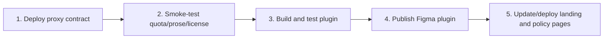

# Deployment and release

> [!warning] Archived snapshot
> This page predates the plugin-only product boundary and Node 22/Wrangler
> validation. Use `README.md`, `.github/RELEASE_TEMPLATE.md`, and
> `packages/plugin/TESTING.md`. See [[ARCHIVE-NOTICE]].

The repository has three independently released surfaces: the Cloudflare Worker, the Figma plugin, and the static landing site. The legacy web app is primarily run locally.

## Recommended dependency order

The proxy should deploy before a plugin build that depends on a changed bearer or response contract.

## Proxy Worker

Configuration lives in `packages/proxy/wrangler.toml`.

Initial infrastructure:

- create `LICENSE_CACHE` KV;
- bind it in Wrangler configuration;
- configure `ANTHROPIC_API_KEY`;
- configure a long random `FIGMA_ID_SALT`;
- deploy from `packages/proxy`.

After deployment, verify:

- free quota response;
- one prose generation;
- quota increment;
- cache-key replay without a second increment;
- Pro activation and device-bound bearer;
- expected CORS and exposed quota headers.

Operational controls:

- Anthropic spend alert;
- review `fair_use_flag` and `upstream_error`;
- Cloudflare WAF rate rule for `/v1/license/*` is still an operational TODO.

## Figma plugin

1. Update package version in `packages/plugin/package.json`.
2. Confirm proxy host in both `src/ui/proxy.ts` and `manifest.json`.
3. Run the full automated quality gate.
4. Complete `packages/plugin/TESTING.md`.
5. Build `dist/main.js` and `dist/ui.html`.
6. Publish through the Figma publishing UI.
7. Ensure the Figma-published version matches the package version.

Current source and manifest target staging. A public production release requires an explicit coordinated host change.

## Landing site

Deploy the static `apps/landing` directory to Cloudflare Pages project `speclayer-landing`.

Before deployment:

- verify monthly/yearly checkout constants;
- verify prices and terms match the plugin;
- verify privacy/security pages match actual transmitted data;
- test video/image assets and motion;
- confirm Figma Community link.

## Legacy web app

The app builds with Next.js and can be started locally. It should remain bound to `localhost`.

> [!danger]
> Do not deploy the legacy app publicly without adding authentication, authorization, tenant isolation, CSRF analysis, secret management, rate limiting, and deployment-specific network controls.

## Release verification checklist

- Root `npm run check` passes.
- Production dependency audit passes.
- Proxy and plugin model/cache-key contract tests pass.
- No staging host is unintentionally shipped as production.
- No keys, private Figma URLs, proprietary exports, `.ds-config.json`, `.spec-data`, or `.spec-cache` files are committed.
- Public privacy and security text matches actual component summary and image transmission.
- Changelog and release notes describe user-visible behavior and migration issues.

## Rollback considerations

- Proxy changes should preserve older bare-key bearers until legacy clients are intentionally retired.
- Plugin-generated doc links need backward-compatible parsing.
- Spec format changes need explicit compatibility handling.
- Landing rollback is static.
- Rotating `FIGMA_ID_SALT` is not a normal rollback; it resets free identities.
