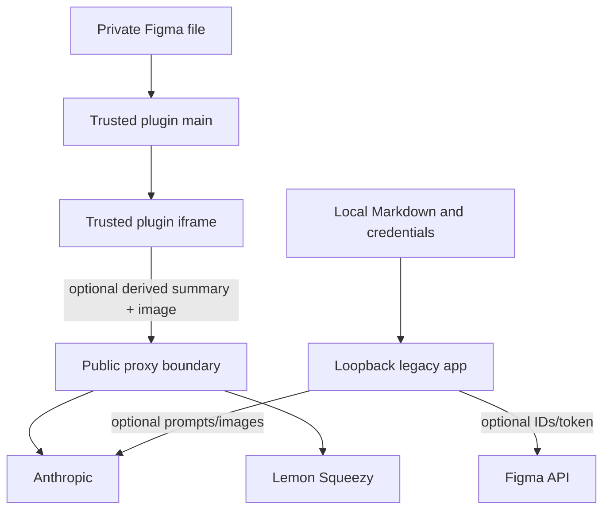

# Security and privacy

## Trust boundaries

## Plugin data handling

Deterministic extraction stays inside Figma unless the person downloads it.

When AI writing is enabled, the plugin may transmit:

- a derived structured summary of component anatomy, props, variants, states, tokens, and layout;
- a rendered PNG image of the selected component;
- a content-derived cache key;
- a Figma user ID header for free usage, or a Pro license bearer.

The proxy should not log prompt or output content.

> [!warning]
> `manifest.json` currently says requests carry only the structured summary, while plugin testing/source behavior includes a rendered image. Public disclosure and manifest reasoning should be aligned with actual behavior.

## Identity and license protection

- Figma user IDs are salted and hashed before server storage.
- License quota identity uses SHA-256 of the key.
- License cache keys hash key plus optional instance.
- The raw license key still crosses the network to the proxy and Lemon Squeezy as required for validation.
- Current plugin bearer includes a device instance ID.

## Proxy controls

- Model fixed to `claude-haiku-4-5`.
- `max_tokens` capped at `3000`.
- Versioned prose cache key required.
- Per-identity rate limiting.
- Free quota and Pro fair-use monitoring.
- Atomic reserve/commit through Durable Objects.
- License format gate and per-IP best-effort activation limiter.
- CORS has no cookies and relies on explicit identity headers.
- Failed upstream generations do not consume quota.

## Accepted proxy risks

### Client-asserted free identity

`X-Figma-User` is not authenticated. A caller can rotate it to mint new free identities. Cost is bounded per request but this remains an abuse vector.

### Best-effort license endpoint limiter

The `20/min` IP limiter is in-isolate. It is not a globally durable control. A Cloudflare WAF rate rule is documented but not configured in repository code.

### Legacy bare-key bearer

Older builds can authenticate with a license key but no device instance. This validates subscription status without enforcing the current device binding.

### License cache delay

Cancellations or refunds may retain Pro behavior for up to the 24-hour validation cache period. This is a deliberate availability tradeoff.

## Legacy web threat model

The app reads/writes local files and stores optional API credentials. Its protections assume:

- loopback binding;
- trusted person on the machine;
- no public tunnel or shared reverse proxy;
- Host and Origin checks;
- safe slug/path validation;
- request and archive size limits.

It does not provide:

- accounts or sessions;
- user/project authorization;
- tenant isolation;
- robust public CSRF posture;
- public secret management;
- public rate limiting.

`Origin: null` is accepted for historical plugin interoperability and is not authentication.

## Filesystem safety

- All slug segments reject separators and traversal.
- Navigation helpers verify targets stay inside the content root.
- Recursive folder deletion performs an additional resolved-path containment check.
- ZIP imports bound compressed size, entry count, per-file expansion, and total expansion.
- Settings use an atomic temporary file and owner-only mode.

## Content safety

Do not commit:

- API or license keys;
- private Figma URLs/file keys;
- customer or proprietary design-system content;
- generated `.spec-data` or `.spec-cache`;
- `.ds-config.json`;
- environment files.

The pre-commit hook scans common key forms, but it is only a backstop.

## Security reporting

Use GitHub private vulnerability reporting. Never place real credentials or private component data in a public issue.

## Recommended follow-ups

1. Align manifest and public privacy wording with image transmission.
2. Configure a durable Cloudflare WAF rate rule for license endpoints.
3. Plan removal of legacy bare-key authentication after old clients age out.
4. Keep the web server loopback-only or add a real public security model.
5. Consider pruning historical quota month keys and bounding Durable Object state further.

